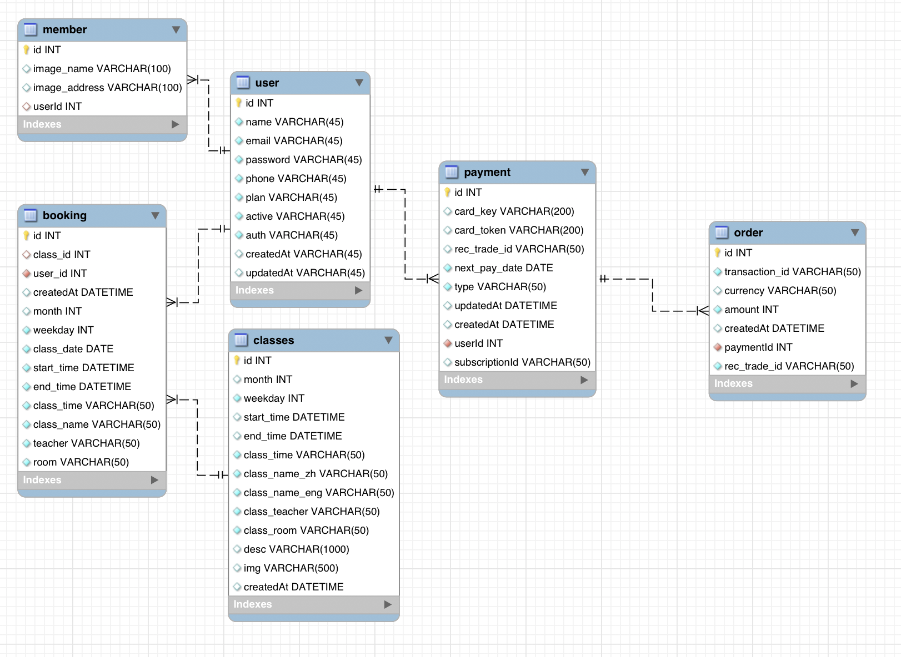

# gymmy-website
It is a Gym class website, users can join us by subscribing and paying monthly, and they can book whatever exercise classes they want.

## tech stack
- Using Trello to manage this project  (Link: https://reurl.cc/VEZjzy)
- Python crawler WorldGym classes
- AWS-S3、Cloudfront upload image
- AWS-RDS: MySQL
  - Optimize MySQL tables by index, Foreign Key
  - Implement a Connection Pool for better performance
- Frontend: HTML, CSS, JS, and Bootstrap with RWD
- Backend: node.js express
- Tappay subscription payment ( monthly payment using cron ) 、Paypal subscription payment
- Google API login 
- Using ORM to prevent SQL- Injection 

## web scraping:

## ER Model

## Demo
### (NOT maintained)
web: https://gymmy.club

test account： 123@123.com

password： 123

#### Tappay test credit card

Credit Card: 4242 4242 4242 4242

Date: 01/23

CCV: 123

#### Paypal payment account

account 1：sb-tqykd6657530@personal.example.com

account 2：sb-tfbtd6657481@personal.example.com

account 3：sb-eu43ya6701843@personal.example.com

## Page
### 1.Home

<!-- #### Home RWD:
 -->

### 2.Project

<!-- #### ProjectRWD:
 -->

### 3.login

### 4.signup

<!-- #### signupRWD:
 -->

### 5.pay-Tappay

### 5.pay-Paypal

<!-- #### 付款頁面RWD:
 -->

### 6.payment finish

### 7.membership profile

### 8.classes

<!-- #### classesRWD:
 -->

### 9.class detail

<!-- ####class detailRWD:
 -->

### 10.bookingclass

### 11.after booking=> profile shows booking info

<!-- ### profileRWD:
 -->

### 12.backend system login

### 13.backend system

