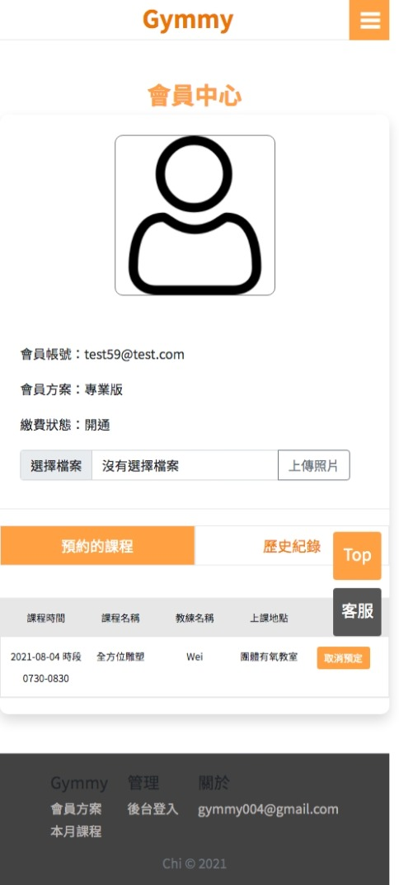

# gymmy-website 健身房預定課程網站

## 網站功能
### 前台：
1. 查看健身房課程
2. 付款(訂閱制)成為會員
3. 預定課程
4. 會員中心查看預定課程/取消預定課程
5. 查看歷史課程
#### 後台：
1. 預定課程管理系統

## 使用技術
- 使用Trello做專案進度管理 （Link : https://reurl.cc/VEZjzy)
- 雲服務多使用AWS的RDS、S3、Cloudfront
- 前端除了 HTML, CSS, JS 之外另搭配Bootstrap
- 後端改用node.js express後端框架
- Tappay訂閱制付款(Cron自動排程實作每月付款機制)、額外增加Paypal金流串接訂閱制付款
- google第三方登入api串接
- jwt 會員系統
- ORM 資料庫串接

## Demo
web: https://gymmy.club

測試帳號： 123@123.com (或自行註冊)

密碼： 123

Credit Card: 4242 4242 4242 4242

Date: 01/23

CCV: 123

## 頁面操作瀏覽
### 1.首頁

#### 首頁RWD:

### 2.方案頁面

#### 方案頁面RWD:

### 3.登入頁面

### 4.註冊頁面

#### 註冊頁面RWD:

### 5.付款頁面-Tappay

### 5.付款頁面-Paypal

#### 付款頁面RWD:

### 6.付款完成頁面

### 7.會員頁面

### 8.所有課程頁面

#### 所有課程頁面RWD:

### 9.個別課程介紹

#### 個別課程頁面RWD:

### 10.預定課程成功訊息頁面

### 11.預定完成後=> 會員中心頁面顯示預定的課程

### 會員中心頁面RWD:

### 12.後台登入頁面

### 13.後台管理頁面
